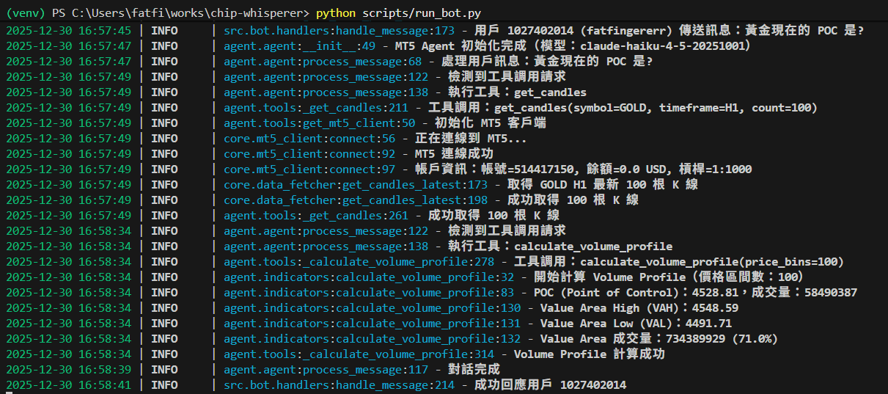

# Chip Whisperer

<div align="center">
  

  **基於量價分析的 MT5 AI 交易代理**

  [](LICENSE)
  [](https://www.metatrader5.com/)
  []()
</div>

---

## 專案簡介

Chip Whisperer 是一個整合 MetaTrader 5 (MT5) 的智能交易分析系統，運用 **Volume Profile（量價分析）** 技術計算關鍵商品價格水平。透過 Claude AI 和 Telegram Bot 整合，提供自然語言查詢介面，讓交易者可以輕鬆獲取市場分析資訊。

### 核心特色

- 🎯 **智能量價分析**：自動計算 POC、Value Area 等關鍵價位
- 📈 **VPPA 視覺化**：Plotly 互動式圖表，支援 K 線圖、Volume Profile、POC/VAH/VAL 線
- 🤖 **AI 驅動決策**：整合 Claude AI，支援自然語言查詢
- 📱 **Telegram Bot**：隨時隨地透過手機查詢市場數據
- 📊 **多種技術指標**：支援 SMA、RSI、布林通道等
- 🔄 **即時數據**：直接連接 MT5 取得最新市場資料
- 💾 **SQLite 快取**：本地快取歷史數據，提升查詢效率
- 🌐 **繁體中文**：完整支援繁體中文介面與回覆

---

## 主要功能

### 1. MT5 數據整合
- 支援多種商品（GOLD、SILVER 等）
- 支援多種時間週期（M1 到 MN1）
- 自動連線管理和錯誤處理

### 2. 技術指標計算
- **Volume Profile Pivot Anchored (VPPA)**：以 Pivot Point 為錨點的量價分析
  - POC (Point of Control)：成交量最大的價格
  - VAH/VAL (Value Area High/Low)：68% 成交量區間
  - Volume Profile：橫向成交量分佈直方圖
- **移動平均線**：SMA、EMA
- **動量指標**：RSI、MACD

### 3. VPPA 視覺化
- **K 線圖**：上漲綠色、下跌紅色
- **Pivot Range 方塊**：淺黃色填充 + 深黃色邊框
- **Volume Profile**：Value Area 內藍色、外灰色
- **POC 線**：紅色虛線標示成交量最大價格
- **VAH/VAL 線**：綠色點線標示 Value Area 範圍
- **Pivot Points 標記**：High 紅色向下三角、Low 綠色向上三角
- **PNG 輸出**：支援高解析度圖片儲存

### 4. Telegram Bot 介面
- 自然語言查詢（例如：「目前黃金的 H1 成本價位在哪裡？」）
- 即時回覆分析結果
- 支援指令和對話兩種模式

---

## 快速開始

### 系統需求

- **作業系統**：Windows 10/11
- **Python**：3.10 或更高版本
- **MetaTrader 5**：已安裝並可正常運作
- **MT5 帳戶**：有效的交易帳戶（實盤或模擬）

### 安裝步驟

```bash
# 1. 克隆專案
git clone --recursive https://github.com/fatfingererr/chip-whisperer.git
cd chip-whisperer

# 2. 建立虛擬環境
python -m venv venv
venv\Scripts\activate

# 3. 安裝依賴
pip install -r requirements.txt

# 4. 設定環境變數
copy .env.example .env
# 編輯 .env 填入您的帳號資訊
```

### 基本配置

編輯 `.env` 檔案：

```env
# MT5 連線（必要）
MT5_LOGIN=12345678
MT5_PASSWORD=your_password
MT5_SERVER=YourBroker-Server

# Telegram Bot（如需使用）
TELEGRAM_BOT_TOKEN=your_bot_token
ANTHROPIC_API_KEY=your_api_key
```


## 使用範例

### 方式一：VPPA 分析與視覺化

```bash
# 分析 GOLD 並輸出 JSON
python scripts/analyze_vppa.py GOLD --output data/gold_vppa.json

# 分析並繪製圖表
python scripts/analyze_vppa.py GOLD --plot

# 自訂輸出路徑
python scripts/analyze_vppa.py GOLD --plot --plot-output output/gold_vppa.png

# 完整參數範例
python scripts/analyze_vppa.py GOLD \
    --count 2000 \
    --pivot-length 20 \
    --price-levels 49 \
    --plot \
    --plot-output output/gold_vppa.png
```

### 方式二：執行範例程式

```bash
# 取得歷史 K 線資料
python examples/fetch_historical_data.py

# Volume Profile 分析
python examples/demo_volume_profile_data.py

# VPPA 視覺化測試
python examples/plot_vppa_basic.py
```

### 方式三：Telegram Bot

```bash
# 啟動 Bot
python scripts/run_bot.py
```

然後在 Telegram 中與 Bot 對話：
- `/start` - 開始使用
- `/help` - 查看說明
- `黃金的 H1 成本價位在哪裡？` - 自然語言查詢

### 方式四：程式碼整合

**VPPA 視覺化**：

```python
from src.visualization import plot_vppa_chart
from src.core.sqlite_cache import SQLiteCacheManager
import json

# 載入 VPPA 分析結果
with open('data/vppa_full_output.json', 'r', encoding='utf-8') as f:
    vppa_data = json.load(f)

# 從快取獲取 K 線資料
cache = SQLiteCacheManager('data/candles.db')
df = cache.query_candles('GOLD', 'M1', start_time, end_time)

# 繪製圖表
fig = plot_vppa_chart(
    vppa_json=vppa_data,
    candles_df=df,
    output_path='output/vppa_chart.png',
    show_pivot_points=True,
    width=1920,
    height=1080
)
```

**MT5 資料獲取**：

```python
from src.core import MT5Config, ChipWhispererMT5Client, HistoricalDataFetcher

# 建立連線並取得資料
with ChipWhispererMT5Client(MT5Config()) as client:
    fetcher = HistoricalDataFetcher(client)
    df = fetcher.get_candles_latest('GOLD', 'H1', 100)
    print(df.head())
```

### Demo

<div align="center">
  

  *Telegram Bot 查詢範例 - Volume Profile 分析*

  <br/>

  

  *Telegram Bot 查詢範例 - 技術指標計算*
</div>

### 核心技術

- **MetaTrader5**：MT5 Python API
- **Anthropic Claude**：AI 自然語言處理
- **python-telegram-bot**：Telegram Bot 框架
- **Plotly + Kaleido**：互動式圖表繪製與 PNG 輸出
- **pandas / numpy**：數據處理
- **SQLite**：本地快取資料庫
- **loguru**：日誌記錄

## 文檔資源

| 文檔                                      | 說明                    |
|-------------------------------------------|-------------------------|
| [快速開始](docs/quick-start.md)           | 安裝和基本設定指南      |
| [MT5 整合說明](docs/mt5-integration.md)   | 詳細的 MT5 API 使用說明 |
| [Telegram Bot 指南](docs/telegram-bot.md) | Bot 設定和使用說明      |

## 貢獻指南

歡迎任何形式的貢獻！

1. Fork 本專案
2. 建立特性分支 (`git checkout -b feature/AmazingFeature`)
3. 提交修改 (`git commit -m 'Add AmazingFeature'`)
4. 推送分支 (`git push origin feature/AmazingFeature`)
5. 開啟 Pull Request

## 風險聲明

**重要提示**：

- 本軟體僅供教育與研究用途
- 交易涉及重大風險，可能導致本金損失
- 使用本軟體進行實際交易前，請務必：
  - 充分了解相關風險
  - 在模擬帳戶中充分測試
  - 諮詢專業財務顧問
- 開發者不對使用本軟體造成的任何損失負責

## 授權條款

本專案採用 [MIT License](LICENSE) 授權

## 聯絡方式

- **專案維護者**：fatfingererr
- **GitHub**：[https://github.com/fatfingererr/chip-whisperer](https://github.com/fatfingererr/chip-whisperer)
- **問題回報**：[Issues](https://github.com/fatfingererr/chip-whisperer/issues)

## 致謝

感謝以下專案的啟發與支持：

- [Volume Profile, Pivot Anchored by dgtrdr (TradingView)](https://www.tradingview.com/pine/?id=PUB%3B3d8b91f226af41dfa36df2db1c21ae80)
- [ariadng/metatrader-mcp-server (GitHub)](https://github.com/ariadng/metatrader-mcp-server)
- [fatfingererr/.clauder (GitHub)](https://github.com/fatfingererr/.claude)

---

<div align="center">

**如果這個專案對您有幫助，請給我們一個 ⭐**

Made with ❤️ by fatfingererr

</div>
