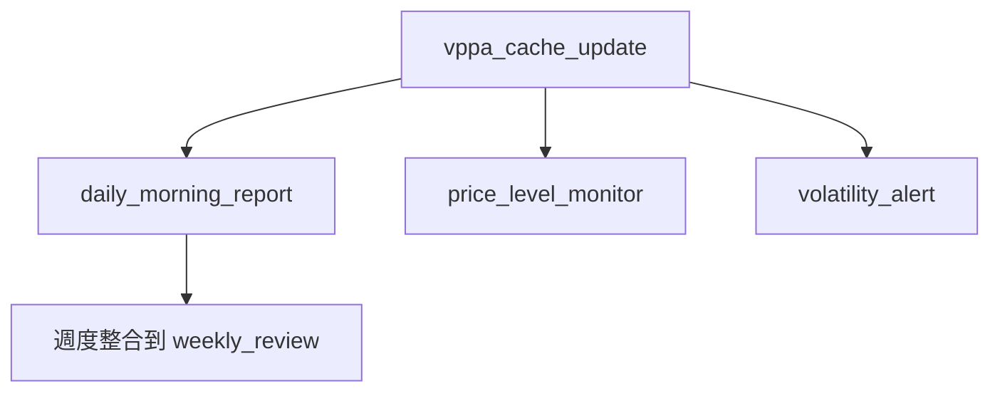

# Arthur（亞瑟）- 定期任務排程

## 任務總覽

Arthur 的定期任務主要聚焦於**市場監控**和**自動分析報告**生成。

---

## 定期任務清單

### 1. 每日市場晨報

```yaml
task_id: daily_morning_report
name: "每日市場晨報"
schedule: "0 8 * * 1-5"  # 週一至週五 08:00
description: "生成每日早盤分析報告"

execution:
  script: "scripts/routines/arthur_morning_report.py"

  steps:
    - name: "取得隔夜數據"
      action: "fetch_overnight_data"
      symbols: ["GOLD", "SILVER"]
      timeframes: ["H1", "H4", "D1"]

    - name: "計算技術指標"
      action: "calculate_indicators"
      indicators:
        - volume_profile
        - rsi
        - sma_20
        - sma_50

    - name: "識別關鍵價位"
      action: "identify_key_levels"

    - name: "生成報告"
      action: "generate_report"
      template: "templates/morning_report.md"

    - name: "發送通知"
      action: "send_telegram_notification"

output:
  format: "markdown"
  destination: "data/reports/daily/{date}_morning.md"
  notification: true

report_template: |
  # 📊 每日市場晨報 - {date}

  ## 市場概覽

  ### GOLD（黃金）
  - **昨收**: {gold_close}
  - **今日 POC**: {gold_poc}
  - **關鍵支撐**: {gold_support}
  - **關鍵壓力**: {gold_resistance}
  - **RSI(14)**: {gold_rsi}
  - **趨勢判斷**: {gold_trend}

  ### SILVER（白銀）
  - **昨收**: {silver_close}
  - **今日 POC**: {silver_poc}
  - **關鍵支撐**: {silver_support}
  - **關鍵壓力**: {silver_resistance}
  - **RSI(14)**: {silver_rsi}
  - **趨勢判斷**: {silver_trend}

  ## 今日關注重點
  {key_observations}

  ## 風險提示
  {risk_warnings}

  ---
  *此報告由 Arthur 自動生成 | {timestamp}*
```

### 2. 關鍵價位突破監控

```yaml
task_id: price_level_monitor
name: "關鍵價位監控"
schedule: "*/5 * * * 1-5"  # 週一至週五，每 5 分鐘
description: "監控價格是否突破關鍵支撐壓力位"

execution:
  script: "scripts/routines/arthur_price_monitor.py"

  steps:
    - name: "取得最新價格"
      action: "fetch_current_price"
      symbols: ["GOLD", "SILVER"]

    - name: "比對關鍵價位"
      action: "check_price_levels"
      levels_source: "data/levels/current_levels.json"

    - name: "判斷是否突破"
      action: "detect_breakout"
      threshold: 0.1  # 突破閾值（百分比）

    - name: "發送突破警報"
      action: "send_breakout_alert"
      condition: "breakout_detected"

alert_template: |
  ⚠️ **價位突破警報**

  **商品**: {symbol}
  **突破類型**: {breakout_type}  # 向上突破 / 向下跌破
  **突破價位**: {level_price} ({level_name})
  **當前價格**: {current_price}
  **時間**: {timestamp}

  建議關注後續走勢。

  ---
  *Arthur 自動監控通知*
```

### 3. 週度市場回顧

```yaml
task_id: weekly_review
name: "週度市場回顧"
schedule: "0 18 * * 5"  # 每週五 18:00
description: "生成本週市場回顧報告"

execution:
  script: "scripts/routines/arthur_weekly_review.py"

  steps:
    - name: "取得本週數據"
      action: "fetch_weekly_data"

    - name: "計算週度統計"
      action: "calculate_weekly_stats"
      metrics:
        - weekly_range
        - weekly_volume
        - trend_change
        - volatility

    - name: "分析量價變化"
      action: "analyze_volume_profile_shift"

    - name: "生成回顧報告"
      action: "generate_weekly_report"

output:
  format: "markdown"
  destination: "data/reports/weekly/{year}_W{week}.md"
  notification: true
```

### 4. 異常波動偵測

```yaml
task_id: volatility_alert
name: "異常波動偵測"
schedule: "*/1 * * * 1-5"  # 每分鐘檢查
description: "監控短期內異常價格波動"

execution:
  script: "scripts/routines/arthur_volatility_monitor.py"

  parameters:
    check_window: 15  # 檢查過去 15 分鐘
    volatility_threshold: 2.0  # 波動超過 2 標準差

  steps:
    - name: "取得短期數據"
      action: "fetch_recent_candles"
      timeframe: "M1"
      count: 15

    - name: "計算波動指標"
      action: "calculate_volatility"
      method: "standard_deviation"

    - name: "判斷是否異常"
      action: "check_anomaly"

    - name: "發送警報"
      action: "send_volatility_alert"
      condition: "anomaly_detected"

alert_template: |
  🚨 **異常波動警報**

  **商品**: {symbol}
  **時間範圍**: 過去 {window} 分鐘
  **價格變動**: {price_change} ({percentage}%)
  **波動強度**: {volatility_score} 標準差
  **當前價格**: {current_price}

  請留意市場動態，可能有重大消息或事件。

  ---
  *Arthur 異常監控通知*
```

### 5. Volume Profile 快取更新

```yaml
task_id: vppa_cache_update
name: "VPPA 數據快取更新"
schedule: "0 */4 * * *"  # 每 4 小時
description: "定期更新 Volume Profile 快取數據"

execution:
  script: "scripts/routines/arthur_vppa_update.py"

  steps:
    - name: "取得最新 K 線"
      action: "fetch_candles"
      symbols: ["GOLD", "SILVER"]
      timeframe: "M1"
      count: 2000

    - name: "計算 VPPA"
      action: "calculate_vppa"
      pivot_length: 20
      price_levels: 49

    - name: "更新快取"
      action: "update_cache"
      cache_path: "data/vppa_cache/"

    - name: "更新關鍵價位"
      action: "update_key_levels"
      output_path: "data/levels/current_levels.json"
```

---

## 任務設定檔結構

```yaml
# config/routines/arthur.yaml

agent:
  name: "Arthur"
  role: "analyst"

routines:
  enabled: true

  tasks:
    - daily_morning_report
    - price_level_monitor
    - weekly_review
    - volatility_alert
    - vppa_cache_update

notifications:
  telegram:
    enabled: true
    chat_id: "{ADMIN_CHAT_ID}"

  log:
    enabled: true
    path: "logs/arthur_routine.log"
    level: "INFO"

error_handling:
  retry_count: 3
  retry_delay: 60  # 秒
  fallback_notification: true
```

---

## 任務執行記錄

每個定期任務執行後，會在以下位置記錄：

```
data/
├── reports/
│   ├── daily/
│   │   └── 2026-01-02_morning.md
│   └── weekly/
│       └── 2026_W01.md
├── levels/
│   └── current_levels.json
├── vppa_cache/
│   ├── GOLD_vppa.json
│   └── SILVER_vppa.json
└── logs/
    └── arthur_routine.log
```

---

## 手動觸發任務

如需手動執行定期任務，可使用以下指令：

```bash
# 手動生成晨報
python scripts/routines/arthur_morning_report.py --manual

# 強制更新 VPPA 快取
python scripts/routines/arthur_vppa_update.py --force

# 執行所有 Arthur 的定期任務
python scripts/run_agent_routines.py --agent arthur --all
```

---

## 任務依賴關係


