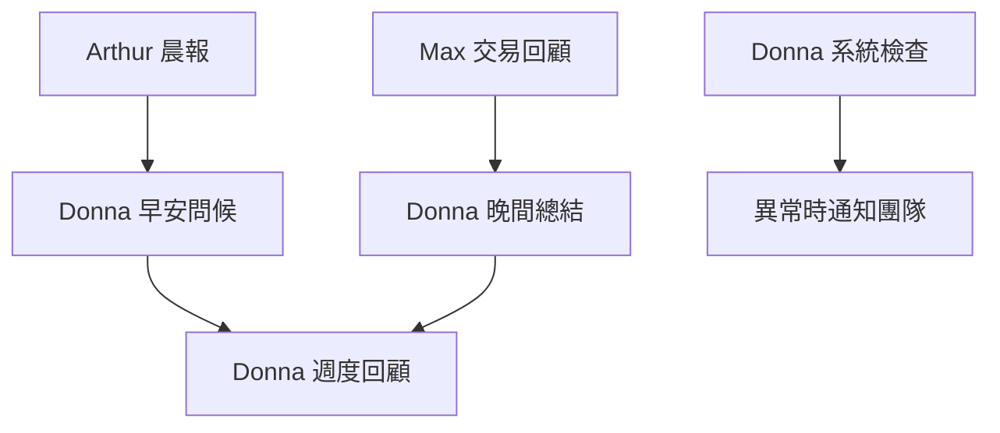

# Donna（朵娜）- 定期任務排程

## 任務總覽

Donna 的定期任務主要聚焦於**日常維護**、**報告彙整**和**提醒服務**。

---

## 定期任務清單

### 1. 每日早安問候

```yaml
task_id: daily_greeting
name: "每日早安問候"
schedule: "0 8 * * 1-5"  # 週一至週五 08:00
description: "發送每日問候和當日概況"

execution:
  script: "scripts/routines/donna_daily_greeting.py"

  steps:
    - name: "取得帳戶概況"
      action: "fetch_account_summary"

    - name: "取得 Arthur 的晨報"
      action: "fetch_morning_report"
      source: "data/reports/daily/{date}_morning.md"

    - name: "檢查待辦事項"
      action: "check_pending_tasks"

    - name: "生成問候訊息"
      action: "generate_greeting"

    - name: "發送問候"
      action: "send_telegram_message"

greeting_template: |
  ☀️ **早安！新的一天開始了**

  **今日日期**: {date} ({weekday})

  ---

  📊 **帳戶快覽**
  - 餘額: {balance}
  - 淨值: {equity}
  - 持倉: {open_positions} 筆

  📈 **市場快報** *(來自 Arthur)*
  {market_brief}

  📋 **今日待辦**
  {pending_tasks}

  ---

  有任何需要隨時告訴我！祝你今天順利 🌟

  ---
  *Donna 每日問候 | {timestamp}*
```

### 2. 每日晚間總結

```yaml
task_id: daily_summary
name: "每日晚間總結"
schedule: "0 21 * * 1-5"  # 週一至週五 21:00
description: "彙整當日活動和重要資訊"

execution:
  script: "scripts/routines/donna_daily_summary.py"

  steps:
    - name: "取得 Max 的交易回顧"
      action: "fetch_trade_review"
      source: "data/reports/trades/{date}_daily.md"

    - name: "取得帳戶變化"
      action: "calculate_daily_change"

    - name: "取得今日對話摘要"
      action: "summarize_conversations"

    - name: "生成晚間總結"
      action: "generate_summary"

    - name: "發送總結"
      action: "send_telegram_message"

summary_template: |
  🌙 **今日總結 - {date}**

  ---

  💰 **帳戶變化**
  - 開盤淨值: {opening_equity}
  - 收盤淨值: {closing_equity}
  - 今日損益: {daily_pnl} ({pnl_percentage}%)

  📊 **交易活動** *(來自 Max)*
  {trade_summary}

  📝 **今日重點**
  {daily_highlights}

  ---

  辛苦了！明天見 😊

  ---
  *Donna 晚間總結 | {timestamp}*
```

### 3. 系統健康檢查

```yaml
task_id: system_health_check
name: "系統健康檢查"
schedule: "0 */6 * * *"  # 每 6 小時
description: "定期檢查系統運作狀態"

execution:
  script: "scripts/routines/donna_health_check.py"

  steps:
    - name: "檢查 MT5 連線"
      action: "check_mt5_connection"

    - name: "檢查 API 服務"
      action: "check_api_service"

    - name: "檢查快取資料"
      action: "check_cache_freshness"
      max_age: 4  # 小時

    - name: "記錄檢查結果"
      action: "log_health_status"

    - name: "發送異常警報"
      action: "send_alert_if_needed"
      condition: "issues_detected"

health_report_format: |
  ## 系統健康報告 - {timestamp}

  | 項目     | 狀態           | 詳情            |
  |----------|----------------|-----------------|
  | MT5 連線 | {mt5_status}   | {mt5_details}   |
  | API 服務 | {api_status}   | {api_details}   |
  | 資料快取 | {cache_status} | {cache_details} |

  整體狀態: {overall_status}

alert_template: |
  ⚠️ **系統異常通知**

  **問題**: {issue_type}
  **詳情**: {issue_details}
  **影響**: {impact}

  **建議動作**:
  {suggested_action}

  ---
  *Donna 系統監控 | {timestamp}*
```

### 4. 報告彙整與存檔

```yaml
task_id: report_archival
name: "報告彙整與存檔"
schedule: "0 23 * * *"  # 每日 23:00
description: "整理當日所有報告並存檔"

execution:
  script: "scripts/routines/donna_report_archive.py"

  steps:
    - name: "收集當日報告"
      action: "collect_daily_reports"
      sources:
        - "data/reports/daily/"
        - "data/reports/trades/"

    - name: "生成彙整檔案"
      action: "create_daily_digest"

    - name: "存檔舊資料"
      action: "archive_old_data"
      retention_days: 30

    - name: "清理暫存檔案"
      action: "cleanup_temp_files"

output:
  format: "markdown"
  destination: "data/archive/{year}/{month}/{date}_digest.md"
```

### 5. 週度工作回顧

```yaml
task_id: weekly_work_review
name: "週度工作回顧"
schedule: "0 19 * * 5"  # 每週五 19:00
description: "彙整本週團隊工作成果"

execution:
  script: "scripts/routines/donna_weekly_review.py"

  steps:
    - name: "匯總 Arthur 的分析"
      action: "summarize_arthur_work"

    - name: "匯總 Max 的交易"
      action: "summarize_max_work"

    - name: "統計用戶互動"
      action: "summarize_interactions"

    - name: "生成週報"
      action: "generate_weekly_report"

    - name: "發送週報"
      action: "send_weekly_report"

weekly_report_template: |
  # 📋 週度工作回顧 - {year} 第 {week} 週

  **週期**: {week_start} ~ {week_end}

  ---

  ## 🎯 Arthur 的分析工作

  - 晨報發送: {morning_reports_count} 份
  - 異常警報: {alerts_count} 次
  - 主要分析:
  {arthur_highlights}

  ---

  ## 💹 Max 的交易紀錄

  - 總交易數: {total_trades}
  - 勝率: {win_rate}%
  - 週損益: {weekly_pnl}
  {max_highlights}

  ---

  ## 💬 用戶互動統計

  - 總互動次數: {interaction_count}
  - 常見問題:
  {common_questions}

  ---

  ## 📌 下週關注

  {next_week_focus}

  ---

  大家辛苦了！週末愉快 🎉

  ---
  *Donna 週度回顧 | {timestamp}*
```

### 6. 定期提醒服務

```yaml
task_id: scheduled_reminders
name: "定期提醒服務"
schedule: "0 9,14,17 * * 1-5"  # 週一至週五 09:00, 14:00, 17:00
description: "發送定期提醒訊息"

execution:
  script: "scripts/routines/donna_reminders.py"

  steps:
    - name: "檢查持倉狀態"
      action: "check_open_positions"

    - name: "檢查未讀報告"
      action: "check_unread_reports"

    - name: "判斷是否需要提醒"
      action: "evaluate_reminder_need"

    - name: "發送適當提醒"
      action: "send_reminder"
      condition: "reminder_needed"

reminder_templates:
  position_check: |
    📌 **持倉提醒**

    你目前有 {position_count} 筆持倉：
    {position_summary}

    記得定期檢視持倉狀態喔！

  report_reminder: |
    📊 **報告提醒**

    有一些報告你可能還沒看：
    {unread_reports}

    需要我幫你整理重點嗎？

  break_reminder: |
    ☕ **休息提醒**

    已經連續工作一段時間了，記得適當休息！

    短暫的休息能讓決策更清晰 😊
```

---

## 任務設定檔結構

```yaml
# config/routines/donna.yaml

agent:
  name: "Donna"
  role: "assistant"

routines:
  enabled: true

  tasks:
    - daily_greeting
    - daily_summary
    - system_health_check
    - report_archival
    - weekly_work_review
    - scheduled_reminders

notifications:
  telegram:
    enabled: true
    chat_id: "{ADMIN_CHAT_ID}"

  tone: "friendly"  # friendly, professional, casual

error_handling:
  retry_count: 2
  retry_delay: 60
  fallback_notification: true
  notify_admin_on_failure: true
```

---

## 任務執行記錄

```
data/
├── archive/
│   └── 2026/
│       └── 01/
│           └── 2026-01-02_digest.md
├── reports/
│   └── weekly/
│       └── 2026_W01_team_review.md
└── logs/
    └── donna_routine.log
```

---

## 手動觸發任務

```bash
# 手動發送問候
python scripts/routines/donna_daily_greeting.py --manual

# 手動系統檢查
python scripts/routines/donna_health_check.py --verbose

# 執行所有 Donna 的定期任務
python scripts/run_agent_routines.py --agent donna --all
```

---

## 與團隊的任務協調



---

## 特殊情境處理

### 假日模式

```yaml
holiday_mode:
  enabled: false  # 可在假日啟用

  modified_schedule:
    daily_greeting: "disabled"
    daily_summary: "disabled"
    system_health_check: "every 12 hours"
    scheduled_reminders: "disabled"

  holiday_message: |
    今天是假日，我會減少打擾。

    如有緊急事項，隨時告訴我！

    祝假日愉快 🌴
```

### 緊急模式

```yaml
emergency_mode:
  triggers:
    - system_down
    - account_anomaly
    - large_loss

  actions:
    - increase_monitoring_frequency
    - notify_all_team_members
    - escalate_to_admin
```
