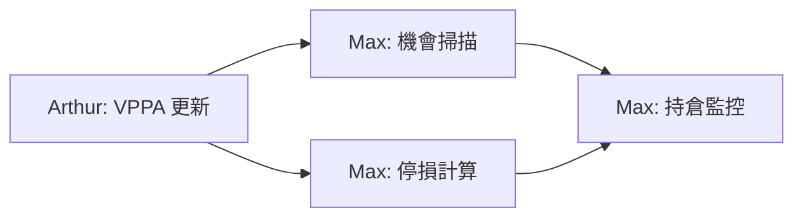

# Max（麥克斯）- 定期任務排程

## 任務總覽

Max 的定期任務主要聚焦於**交易機會監控**、**持倉管理**和**風險警示**。

---

## 定期任務清單

### 1. 交易機會掃描

```yaml
task_id: trade_opportunity_scan
name: "交易機會掃描"
schedule: "0 */2 * * 1-5"  # 週一至週五，每 2 小時
description: "掃描符合交易條件的機會"

execution:
  script: "scripts/routines/max_opportunity_scan.py"

  steps:
    - name: "取得 Arthur 的分析"
      action: "fetch_arthur_analysis"
      source: "data/vppa_cache/"

    - name: "取得當前價格"
      action: "fetch_current_prices"
      symbols: ["GOLD", "SILVER"]

    - name: "評估進場條件"
      action: "evaluate_entry_conditions"
      criteria:
        - price_near_poc: 0.5  # 價格接近 POC 的百分比
        - price_near_value_area: true
        - risk_reward_min: 2.0

    - name: "計算交易參數"
      action: "calculate_trade_parameters"
      parameters:
        - entry_price
        - stop_loss
        - take_profit
        - position_size

    - name: "發送機會通知"
      action: "send_opportunity_alert"
      condition: "opportunity_found"

alert_template: |
  📈 **交易機會通知**

  **商品**: {symbol}
  **方向**: {direction}

  **進場參考**
  - 進場價格: {entry_price}
  - 停損: {stop_loss} ({sl_distance}點)
  - 停利: {take_profit} ({tp_distance}點)

  **風險報酬比**: {rr_ratio}

  **分析依據**
  {analysis_summary}

  ⚠️ 此為系統提示，請自行評估後決定是否進場。

  ---
  *Max 自動掃描通知 | {timestamp}*
```

### 2. 持倉監控

```yaml
task_id: position_monitor
name: "持倉狀態監控"
schedule: "*/5 * * * 1-5"  # 週一至週五，每 5 分鐘
description: "監控當前持倉的盈虧狀態"

execution:
  script: "scripts/routines/max_position_monitor.py"

  steps:
    - name: "取得持倉資訊"
      action: "fetch_open_positions"

    - name: "計算浮動盈虧"
      action: "calculate_floating_pnl"

    - name: "檢查接近停損/停利"
      action: "check_sl_tp_proximity"
      threshold: 50  # 接近閾值（點數）

    - name: "發送持倉報告"
      action: "send_position_report"
      condition: "has_positions"

    - name: "發送風險警報"
      action: "send_risk_alert"
      condition: "risk_detected"

position_report_template: |
  📊 **持倉狀態報告**

  **持倉總覽**
  - 總持倉數: {total_positions}
  - 總浮動盈虧: {total_floating_pnl}

  **各倉位狀態**
  {position_details}

  **風險指標**
  - 保證金使用率: {margin_usage}%
  - 最大單筆虧損: {max_drawdown}

  ---
  *Max 持倉監控 | {timestamp}*

risk_alert_template: |
  🚨 **風險警報**

  **問題**: {risk_type}

  **詳情**:
  {risk_details}

  **建議動作**:
  {suggested_action}

  請立即評估是否需要調整倉位！

  ---
  *Max 風險監控 | {timestamp}*
```

### 3. 停損移動提醒

```yaml
task_id: trailing_stop_reminder
name: "移動停損提醒"
schedule: "*/10 * * * 1-5"  # 每 10 分鐘
description: "當持倉獲利達到一定程度時，提醒調整停損"

execution:
  script: "scripts/routines/max_trailing_stop.py"

  steps:
    - name: "取得持倉資訊"
      action: "fetch_open_positions"

    - name: "計算浮動獲利"
      action: "calculate_floating_profit"

    - name: "判斷是否需要移動停損"
      action: "check_trailing_stop_condition"
      rules:
        - profit_threshold: 1.0  # 獲利達 1R 時提醒
        - breakeven_profit: 0.5  # 獲利達 0.5R 時建議保本

    - name: "發送提醒"
      action: "send_trailing_reminder"
      condition: "trailing_needed"

reminder_template: |
  💡 **移動停損提醒**

  **商品**: {symbol}
  **方向**: {direction}
  **目前獲利**: {current_profit} ({profit_ratio}R)

  **建議操作**:
  {suggested_action}

  - 原始停損: {original_sl}
  - 建議新停損: {new_sl}

  調整停損可以鎖定部分利潤，降低回吐風險。

  ---
  *Max 停損提醒 | {timestamp}*
```

### 4. 每日交易回顧

```yaml
task_id: daily_trade_review
name: "每日交易回顧"
schedule: "0 22 * * 1-5"  # 週一至週五 22:00
description: "回顧當日交易表現"

execution:
  script: "scripts/routines/max_daily_review.py"

  steps:
    - name: "取得當日交易記錄"
      action: "fetch_daily_trades"

    - name: "計算交易統計"
      action: "calculate_trade_statistics"
      metrics:
        - total_trades
        - win_rate
        - profit_factor
        - total_pnl
        - largest_win
        - largest_loss

    - name: "生成回顧報告"
      action: "generate_review_report"

    - name: "發送報告"
      action: "send_daily_report"

output:
  format: "markdown"
  destination: "data/reports/trades/{date}_daily.md"
  notification: true

report_template: |
  # 📋 每日交易回顧 - {date}

  ## 交易統計

  | 指標 | 數值 |
  |------|------|
  | 總交易數 | {total_trades} |
  | 勝率 | {win_rate}% |
  | 獲利因子 | {profit_factor} |
  | 總盈虧 | {total_pnl} |
  | 最大單筆獲利 | {largest_win} |
  | 最大單筆虧損 | {largest_loss} |

  ## 交易明細

  {trade_details}

  ## 今日心得

  {auto_insights}

  ## 明日關注

  {tomorrow_focus}

  ---
  *Max 每日回顧 | {timestamp}*
```

### 5. 週末交易總結

```yaml
task_id: weekly_trade_summary
name: "週度交易總結"
schedule: "0 20 * * 6"  # 每週六 20:00
description: "總結本週交易表現和心得"

execution:
  script: "scripts/routines/max_weekly_summary.py"

  steps:
    - name: "匯總本週交易"
      action: "aggregate_weekly_trades"

    - name: "計算週度統計"
      action: "calculate_weekly_stats"

    - name: "分析交易模式"
      action: "analyze_trade_patterns"
      aspects:
        - best_trading_hour
        - best_symbol
        - common_mistakes
        - improvement_areas

    - name: "生成週報"
      action: "generate_weekly_report"

output:
  format: "markdown"
  destination: "data/reports/trades/{year}_W{week}_summary.md"
  notification: true
```

### 6. 重大事件前提醒

```yaml
task_id: event_risk_reminder
name: "重大事件風險提醒"
schedule: "0 8 * * 1-5"  # 每日 08:00
description: "提醒當日重大經濟數據發布"

execution:
  script: "scripts/routines/max_event_reminder.py"

  steps:
    - name: "取得經濟日曆"
      action: "fetch_economic_calendar"
      importance: ["high"]

    - name: "篩選相關事件"
      action: "filter_relevant_events"
      currencies: ["USD", "EUR", "GBP", "JPY"]

    - name: "發送提醒"
      action: "send_event_reminder"
      condition: "has_events"

reminder_template: |
  📅 **今日重大事件提醒**

  **日期**: {date}

  **重要事件**:
  {event_list}

  **風險提示**:
  - 事件發布期間市場波動可能加劇
  - 建議減少倉位或暫停交易
  - 避免在事件前後設置過近的停損

  謹慎操作！

  ---
  *Max 事件提醒 | {timestamp}*
```

---

## 任務設定檔結構

```yaml
# config/routines/max.yaml

agent:
  name: "Max"
  role: "trader"

routines:
  enabled: true

  tasks:
    - trade_opportunity_scan
    - position_monitor
    - trailing_stop_reminder
    - daily_trade_review
    - weekly_trade_summary
    - event_risk_reminder

notifications:
  telegram:
    enabled: true
    chat_id: "{ADMIN_CHAT_ID}"

  priority_levels:
    urgent: ["risk_alert", "sl_tp_proximity"]
    normal: ["opportunity", "reminder"]
    low: ["review", "summary"]

error_handling:
  retry_count: 3
  retry_delay: 30  # 秒
  fallback_notification: true
```

---

## 任務執行記錄

每個定期任務執行後，會在以下位置記錄：

```
data/
├── reports/
│   └── trades/
│       ├── 2026-01-02_daily.md
│       └── 2026_W01_summary.md
├── positions/
│   └── current_positions.json
└── logs/
    └── max_routine.log
```

---

## 手動觸發任務

```bash
# 手動掃描交易機會
python scripts/routines/max_opportunity_scan.py --manual

# 手動生成交易回顧
python scripts/routines/max_daily_review.py --date 2026-01-02

# 執行所有 Max 的定期任務
python scripts/run_agent_routines.py --agent max --all
```

---

## 與 Arthur 的任務協作


